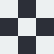

#  Chess board

This is a chess board which includes numbers and letters on the sides and unicode chess pieces.

- The chess board is built on a table html element with rows and columns. There is two loops that runs 10 time each to render the 8 x 8 chess board and the number and letter cells.

- The color pattern of the chess board is selected by (row + column) % 2 == 0 if true then dark color else light.

- The chess pieces are stored in a associative array where the key is x an y coordinates of rows and columns.